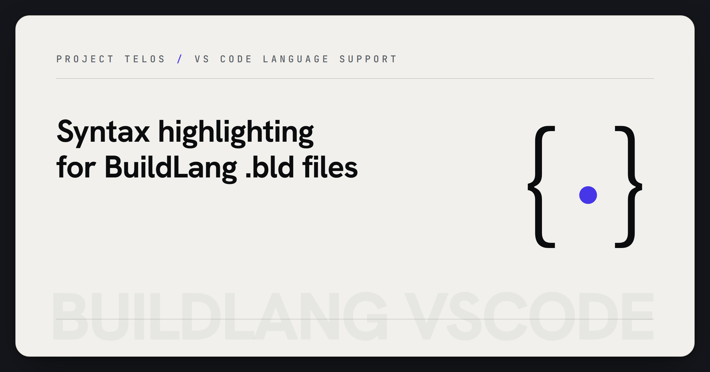

<p align="center">
  
</p>

# BuildLang for Visual Studio Code

> Syntax highlighting and editor configuration for the BuildLang effects-oriented systems language.

[](LICENSE)


[](https://github.com/HarperZ9/buildlang-vscode/actions/workflows/ci.yml)

[](https://github.com/HarperZ9/build-universe)

Syntax highlighting and editor configuration for
**[BuildLang](https://github.com/HarperZ9/buildlang)**, an effects-oriented
compiler project with a verified C path, shader output, and experimental
backend research.

## Features

- Syntax highlighting for `.bld` files
- Full keyword coverage - 61 language keywords including the effect system (`with`, `effect`, `handle`, `resume`, `perform`) and AI primitives (`ai`, `neural`, `infer`)
- Smart indentation, bracket matching, and auto-closing pairs
- Comment toggles (`Ctrl+/`)
- File icon for `.bld`

## About BuildLang

BuildLang is an effects-oriented systems language with a multi-backend compiler written in Rust. It compiles to:

- **C** (primary)
- **HLSL**, **GLSL** (shader output)
- **SPIR-V**, **LLVM IR**, **WebAssembly**, **x86-64**, **ARM64**

```build
fn main() ~ Console {
    println!("Hello from BuildLang!");
}
```

## Install

From the Marketplace: **View -> Extensions -> search "BuildLang"**, click Install.

From `.vsix` directly:

```bash
code --install-extension buildlang-0.1.0.vsix
```

## Usage

Once installed, the extension activates automatically for any file with the
`.bld` extension - no commands or configuration required. See
**[USAGE.md](USAGE.md)** for what the extension provides, how to verify it is
active, and worked examples (including a sample under
[`examples/`](examples/)).

This extension is editor support only; it provides syntax highlighting and
language configuration. It does not bundle or run the BuildLang compiler. To
build or run `.bld` programs, use the `buildc` toolchain from the
[language repo](https://github.com/HarperZ9/buildlang).

## Links

- [Language repo](https://github.com/HarperZ9/buildlang)
- [Grammar repo](https://github.com/HarperZ9/buildlang-tmLanguage)
- [Build Universe ecosystem](https://github.com/HarperZ9/build-universe)

## License

MIT. Copyright (c) 2026 Zain Dana Harper.
